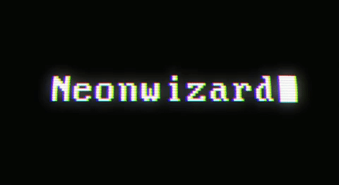

<!-- More info, tips and tricks for making GitHub Profile README can be found in my article at https://towardsdatascience.com/build-a-stunning-readme-for-your-github-profile-9b80434fe5d7 -->

<!--  -->

### Hello world! 👋

I'm Wes, a software engineer with a specialty in fullstack web, machine learning, and Unity game development. I live in the United States, and currently go to school at University of Washington. You can find me on [Twitter][1] or [LinkedIn][2] :)

### About me:

- 🌱 I’m currently learning Go
- 👯‍♂️ I'm looking to collaborate 🤝
- 📚 I'm always looking for new things to learn about
- 💾 Ask me about my musical floppy drives!
- ⚡️ Feel free to fork and PR my repositories, help is appreciated :)
- 📫 How to reach me: contact@wizardlywonders.xyz

 

## 📈 Github stats

<!-- 
 -->

<a href="https://github.com/NeonWizard/NeonWizard">
  

<!-- links to your social media accounts -->

[1]: https://twitter.com/wespooky
[2]: https://www.linkedin.com/in/wesmiravete/
[3]: https://github.com/NeonWizard

<!-- Resources -->
<!-- Icons: https://simpleicons.org/ -->
<!-- GitHub Stats: https://github.com/anuraghazra/github-readme-stats -->
<!-- Emojis: https://emojipedia.org/emoji/ -->
<!-- HTML Emojis: https://www.fileformat.info/index.htm -->
<!-- Shields: https://shields.io/ -->
<!-- Awesome GitHub Profile README: https://github.com/abhisheknaiidu/awesome-github-profile-readme -->

<!-- Inspirations -->
<!-- https://github.com/MartinHeinz -->
<!-- https://github.com/lukeocodes -->
<!-- https://github.com/FirePing32 -->
